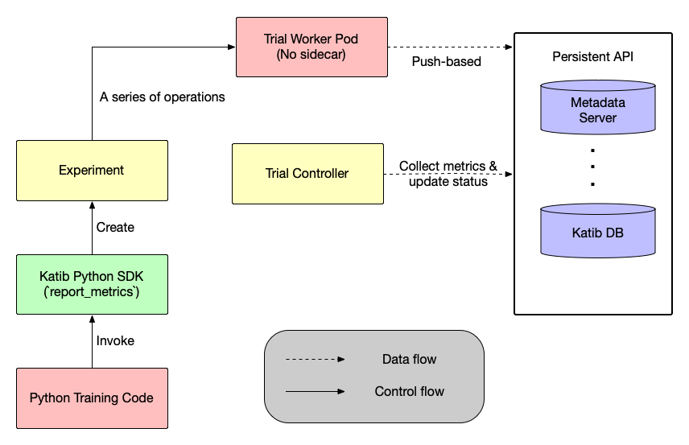

# Push-based Metrics Collection Proposal

## Links

- [katib/issues#577([Enhancement Request] Metrics Collector Push-based Implementation)](https://github.com/kubeflow/katib/issues/577)

## Motivation

[Katib](https://github.com/kubeflow/katib) is a Kubernetes-native project for automated machine learning (AutoML). It can not only tune hyperparameters of applications written in any language and natively supports many ML frameworks, but also supports features like early stopping and neural architecture search.

In the procedure of tuning hyperparameters, Metrics Collector, which is implemented as a sidecar container attached to each training container in the [current design](https://github.com/kubeflow/katib/blob/master/docs/proposals/metrics-collector.md), will collect training logs from Trials once the training is complete. Then, the Metrics Collector will parse training logs to get appropriate metrics like accuracy or loss and pass the evaluation results to the HyperParameter tuning algorithm.

However, current implementation of Metrics Collector is pull-based, raising some [design problems](https://github.com/kubeflow/training-operator/issues/722#issuecomment-405669269) such as determining the frequency we scrape the metrics, performance issues like the overhead caused by too many sidecar containers, and restrictions on developing environments which must support sidecar containers. Thus, we should implement a new API for Katib Python SDK to offer users a push-based way to store metrics directly into the Katib DB and resolve those issues raised by pull-based metrics collection.


Fig.1 Architecture of the new design

### Goals
1. **A new parameter in Python SDK function `tune`**: allow users to specify the method of collecting metrics(push-based/pull-based).

2. **A code injection function in mutating webhook**: recognize the metrics output lines and replace them with push-based metrics collection code.

3. The final metrics of worker pods should be **pushed to Katib DB directly** in the push mode of metrics collection.

### Non-Goals
1. Implement authentication model for Katib DB to push metrics.

2. Support pushing data to different types of storage system(prometheus, self-defined interface etc.)


## API

### New Parameter in Python SDK Function `tune`

We decided to add `metrics_collection_mechanism` to `tune` function in Python SDK.

```Python
def tune(
    self,
    name: str,
    objective: Callable,
    parameters: Dict[str, Any],
    base_image: str = constants.BASE_IMAGE_TENSORFLOW,
    namespace: Optional[str] = None,
    env_per_trial: Optional[Union[Dict[str, str], List[Union[client.V1EnvVar, client.V1EnvFromSource]]]] = None,
    algorithm_name: str = "random",
    algorithm_settings: Union[dict, List[models.V1beta1AlgorithmSetting], None] = None,
    objective_metric_name: str = None,
    additional_metric_names: List[str] = [],
    objective_type: str = "maximize",
    objective_goal: float = None,
    max_trial_count: int = None,
    parallel_trial_count: int = None,
    max_failed_trial_count: int = None,
    resources_per_trial: Union[dict, client.V1ResourceRequirements, None] = None,
    retain_trials: bool = False,
    packages_to_install: List[str] = None,
    pip_index_url: str = "https://pypi.org/simple",
    # The newly added parameter metrics_collector_config.
    # It specifies the config of metrics collector, for example,
    # the kind of metrics collector.
    metrics_collecter_config: Dict[str, Any] = None, 
)
```

With a small example:

```Python
import kubeflow.katib as katib

# Step 1. Create an objective function.
def objective(parameters):
    # Import required packages.
    import time
    time.sleep(5)
    # Calculate objective function.
    result = 4 * int(parameters["a"]) - float(parameters["b"]) ** 2
    # Katib parses metrics in this format: <metric-name>=<metric-value>.
    print(f"result={result}")

# Step 2. Create HyperParameter search space.
parameters = {
    "a": katib.search.int(min=10, max=20),
    "b": katib.search.double(min=0.1, max=0.2)
}

# Step 3. Create Katib Experiment with 12 Trials and 2 CPUs per Trial.
katib_client = katib.KatibClient(namespace="kubeflow")
name = "tune-experiment"
katib_client.tune(
    name=name,
    objective=objective,
    parameters=parameters,
    objective_metric_name="result",
    max_trial_count=12,
    resources_per_trial={"cpu": "2"},
    metrics_collector_config={"kind": "None"},
)

# Step 4. Get the best HyperParameters.
print(katib_client.get_optimal_hyperparameters(name))
```

## Implementation

### Add New Parameter in `tune`

As is mentioned above, we decided to add `metrics_collection_mechanism` to the tune function in Python SDK. Also, we have some changes to be made:

1. Disable injection: set `katib.kubeflow.org/metrics-collector-injection` to `disabled` when the push-based way of metrics collection is adopted so as to disable the injection of the metrics collection sidecar container.

2. Configure the way of metrics collection: set the configuration `spec.metricsCollectionSpec.collector.kind`(specify the way of metrics collection) to `NoneCollector`.

### Code Injection in Webhook

We decided to implement a code replacing function in Experiment Mutating Webhook. When `spec.metricsCollectionSpec.collector.kind` is set to `NoneCollector`, the code replacing function will recognize the metrics output lines (e.g. print, log.Info, e.t.c.) and replace them with push-based metrics collection code which will be discussed in the next section. It’s a better decision compared with offering users a `katib_client.push`-like interface, for that users can’t use a yaml file to define this operation.

### Push-based Metrics Collection Code

The push-based metrics collection code is a function making a grpc call to the persistent API to store training metrics. It will be injected to container args in the Experiment Mutating Webhook and then be called inside the Trial Worker Pod to push metrics to Katib DB.

### Collection of Final Metrics

The final metrics of worker pods should be pushed to Katib DB directly in the push mode of metrics collection.

\#WIP